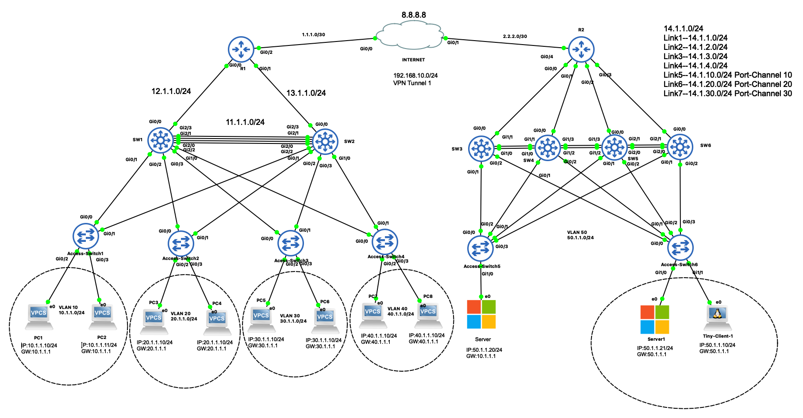

All protocols. This lab is based on a youtube video by PM Networking. 

The following protocols were configured. 

OSPF
VTP
EGRIP
VPN
VLAN

Topology as follows:

Application: GNS3
Images: Cisco iosv CML, Windows Server 2022, Tiny Client, VPC. 

Credits - 
PM Networking ([Youtubelink](https://youtu.be/de7axFBMayk?si=HYKmQQtSt9q93D5z)https://youtu.be/de7axFBMayk?si=HYKmQQtSt9q93D5z)
